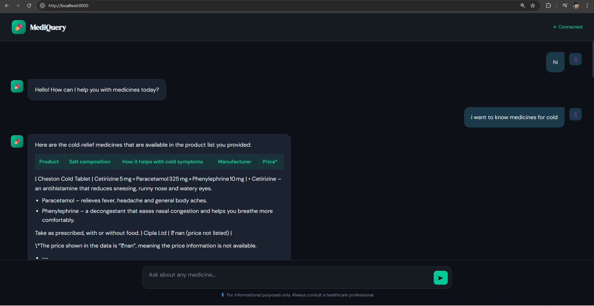

# MediQuery — AI Medical RAG Assistant

> A scalable AI-powered Medical Question Answering system built using Retrieval-Augmented Generation (RAG). Ask anything about medicines — get instant, accurate answers backed by a real medicine database.

---
## Demo — AI Medical Assistant in Action



---
## Example Queries

- "medicines for BP"
- "medicines for sugar"
- "medicines for cold"

## Sample Output

**User:** i want to know medicines for cold  

**Response:**
- Cheston Cold Tablet  
- Contains Cetirizine, Paracetamol, Phenylephrine  
- Helps relieve sneezing, fever, congestion
  
---
## Live Demo

Run instantly via Docker:

```bash
docker pull 8766359332/mediquery
docker run -p 8000:8000 --env-file .env 8766359332/mediquery
```

Then open: [http://localhost:8000](http://localhost:8000)

---

## How It Works

1. A medicine database (CSV) is chunked and embedded using **HuggingFace sentence-transformers**
2. Embeddings are stored in a **ChromaDB** vector database
3. When a user asks a question, relevant medicine docs are retrieved from ChromaDB
4. Retrieved context is passed to **Groq LLM** (GPT-OSS 120B) via LangChain's `ConversationalRetrievalChain`
5. The answer is streamed back through a **FastAPI** backend to a clean chat UI

---

## Tech Stack

| Layer | Technology |
|---|---|
| Backend | FastAPI |
| RAG Framework | LangChain |
| Vector Database | ChromaDB |
| Embeddings | HuggingFace `all-MiniLM-L6-v2` |
| LLM | Groq (GPT-OSS 120B) |
| Containerization | Docker |

---

## Project Structure

```
mediquery/
├── main.py               # FastAPI app — routes and lifespan
├── rag_pipeline.py       # RAG logic — embeddings, retriever, LLM chain
├── ingest.py             # One-time script to build ChromaDB from CSV
├── Medicine_database.csv # Source medicine data
├── static/
│   └── index.html        # Chat UI frontend
├── requirements.txt
├── Dockerfile
├── .env.example          # Environment variable template
└── .gitignore
```

---

## Setup & Run Locally

### 1. Clone the repo

```bash
git clone https://github.com/Sourabh92133/medicine_rag_fastapi
cd medicine_rag_fastapi
```

### 2. Create a virtual environment

```bash
python -m venv rag_env
source rag_env/bin/activate  # Windows: rag_env\Scripts\activate
```

### 3. Install dependencies

```bash
pip install -r requirements.txt
```

### 4. Set up environment variables

```bash
cp .env.example .env
# Add your GROQ_API_KEY inside .env
```

### 5. Build the vector database (run once)

```bash
python ingest.py
```

### 6. Start the server

```bash
uvicorn main:app --reload
```

Visit: [http://localhost:8000](http://localhost:8000)

---

## Run with Docker

```bash
# Pull from Docker Hub
docker pull 8766359332/mediquery

# Run with your .env file
docker run -p 8000:8000 --env-file .env 8766359332/mediquery
```

---

## Environment Variables

Create a `.env` file based on `.env.example`:

```env
GROQ_API_KEY=your_groq_api_key_here
```

Get your free Groq API key at: [https://console.groq.com](https://console.groq.com)

---

## Author

**Sourabh** — AI/ML Engineer  
[GitHub](https://github.com/Sourabh92133) 

---

> *For informational purposes only. Always consult a healthcare professional.*
